## Thursday 4/07/2024

### .NET [network enable technology] INTRODUCTION

- .net used to develop
  - web applictions
  - mobile
  - desktop
  - UI
  - gaming
- .net = Platform[set of resources] from microsoft for building software applications.
- resources of .nett
- frameworks :
- IDE's
- Languages
- web services
- Framework :


### FCL

- FCL- collection of methods , stored in GAC[ globally assembly cache](c:\windows:assembly) folder as dynamic link library files[dll]/exe.files
- dll files are having many programs , that is connected to exec files like : notepad , word ,excel etc..
- assembly means either exec / dll files.
- collection of dll files are FCL.

### CLR

- CLR : converts IL code to executable code
- .Net programs are stored as .cs extensions
- csharp is a language
- compilation : csc, .exe[msIL{intermediate language} code]
- 
  
- clr allocates memory , garbage collector
- clr generates appropriate messages like exceptions ,errors
- 
- framework is a part of windows.
- Managed by clr is a managed code.
- 
- inbuilt .Net languages :
  functional sharp f#, visual basic , c# , c++
- 

### Programming


### Friday : 5/07/2024

- Method
- Public static void methodname()
  {

  }

- Access specifier : Default is private
  - Private , Public , Protected , internal , protected internal
- Methods are called only via class names , object names.-->static
- Return type : method will not return value, without void we can give the datatype.
  
  
  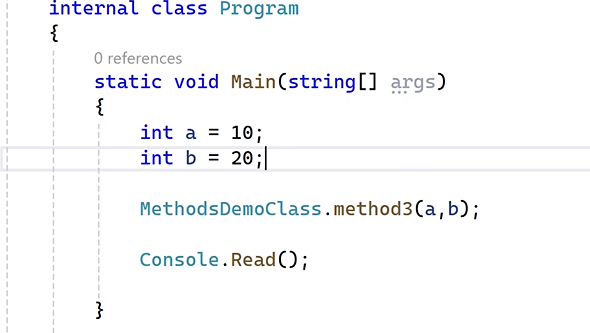
- optional parameter:
- 
  
- Named parameter
  
- method with " out" keyword: public static void method(out int a,out int b)
- methods can return only 1 value , we want to print multiple values we use out keyword.
  
- Arrays : collection of variables, we can use arrays to give multiple values to 1 variable.
  
  
- Single Dimensional Array: holds only 1 row at a time.
- int[] a={10,20,30};
- console.writeLine(a[0]) //prints 10
  
  
- for each loop: only reads , when we dont want to modify data, prints all values , doesn't require any indexes .
- console.WriteLine(a.length) = gives length
- a.rank = gives dimension of the array
- want to give arrays values dynamically : use new
- int [] a= new int[3]; // new allocates allocates memory space.// 3 no of values .
- 
- multi Dimensional Array: holds more than 1 row at a time.
- int[,] a = {
  {10, 50},{20,30},{20,50,30}
  }
- use a.getlength(0=row),
- a.length(1=column length) : to get length
- 
- Jagged array : Multi d array , row is fixed , columns are not fixed
- int[][] a = new int [3][]; // 3 rows , 0 columns
- a[0]= new int[2] {10,20};
- a[1]= new int[3] {10,20,40};
- a[2]= new int[4] {30, 40,10,20};
- 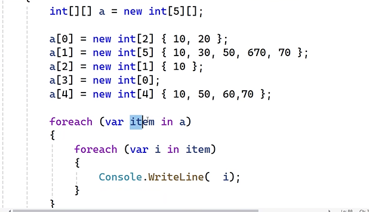

## OOP in C#


- Example : Object car
- 
- Properties : Data members , anything deals with data
- Bhehaviour/ action : Functions
- Object = Attributes + Method(Actions)
- Class : used to perform actions, properties
  
  
  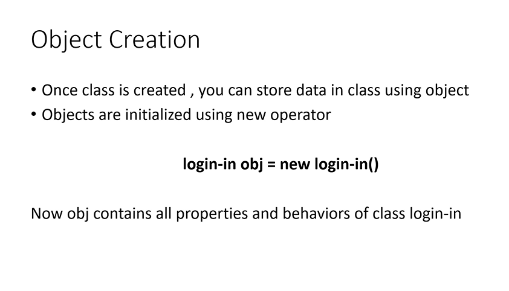
- Object is created to store data in class.
  
  
- Property type :

  - public int age
    {

    }

- Property block = get + set
- get
  {
  set
  {// validation code

}
}

- 

- propfull : short cut to get property ,have validations
- prop : doesn't have any validations

### Types of classes:

- Instance[object] : any class that can able to created obj is an intance class
- Static[common for all variable] : contain static members only(non static not allowed), in this case we cannot call the method, we can call members by using class names.
- when ever u want to maintain single copy of logic , then use static class
  
- Sealed: This class cannot be inherited, can create a obj by using sealed lasss.
- 
- 
- 
- Abstract: cannot create obj but inheritance is allowed.
  - 
- Partial : allows to share the class members in more than 1 file.
- 
- 

### Constructor : having method name as class name

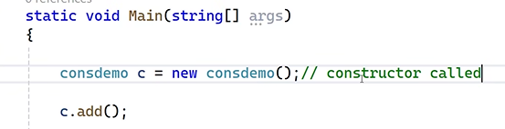

- Types:
- 
- static is called only once
- instance is called how many times the object got intialized

### Day3 : Monday (8/7/2024)

#### Encapsulation:

- Provides security
- We can Acheive Encapsulation by using class , u need to merge varibales and methods into a single class, so that only that clas members access the value.

#### Inheritance:

- Code Reusability
- 1 class uses the members of another class.
- class which uses the feature Dervied class/ child class / sub class.
- clas provides features called as Base/ Super/ Parent class
- C# suports single inheritance.
- 

#### Polymorphism:

- Performance , Code Flexibility
- Having many forms
- 1.Static /compile
- 
- Eg : Writeline Method
- 
- 2.Dynamic / Runtime polymorphism
- methods having the same name , same signature but fifferent in the implementation
- Methods are overridden
- minimum 2 classes are required for dynamic polymorphism
- We have to use inheritance
- In the Base class u need to use "Virtual keyword".
- In the Derived class , u need to use Override keyword.
  
- 1 obj can call many derived class functions
- 
- Virtual is Repalced the base classes
- 1 virtual , many overrides.

#### Abstraction:

- Code Simplicity
- used to display only neccessaey and essential features of an object to outside world.
- 
- user has to use only method 4()
- 
- opposite of overriding = Shadowing
- Shadowing is achived by using new keyword
- if u dont wish to overide the method , u cam use new keyword.
- it is the way to inform for the user that method id not overridden.

#### Interface :


- similar to class , but we dont have implementation
  - 
- we cant implement
  - 
- Not suppose to store any data in interface , and variables also
- 
- 
- We cant give access specifiers
- By default it is public
- Importance of interface
- 
- Proper naming conventions
- show potential fixes , implemnet interface:
  
- Implementation:

  

- loosely coupled
  

```c#
Example :
namespace DotNettraining
{
    internal class Class7
    {
    }
    interface Imathinter
    {
        void Add(int x, int y);
        void Sub(int x, int y);
    }

    interface Idbinter
    {
        void Readfromdatabase();
        void Storeindatabase();
    }
    internal class Interfacedemo : Imathinter, Idbinter
    {
        public void Add(int x, int y)
        {
        }

        public void Sub(int x, int y)
        {
        }

        public void Readfromdatabase()
        {
            Console.WriteLine("read method called");
        }

        public void Storeindatabase()
        {
            Console.WriteLine("store method called");
        }
    }
}
```

```c#
Calling :
Idbinter ob = new Interfacedemo();
ob.Storeindatabase();
ob.Readfromdatabase();

Imathinter m = new Interfacedemo();
m.Sub(100, 3);
m.Add(4, 5);
Console.ReadLine();
```

- commom method signature:We Dont have 2 same methods in 1 class.
  
- we have to create interface to avoid this problem
  
- we dont specify the public / private
  
- implementation:
- 

```c#
Example:

interface Ione

{

     void Add(int x, int y);

}

interface Itwo

{

     void Add(int x, int y);

}

internal class InterDemo:Ione, Itwo

{

      void Ione.Add(int x, int y)

     {

         Console.WriteLine(x + y);

     }

      void Itwo.Add(int x, int y)

     {

         Console.WriteLine("the sum is " + (x + y));

     }

}
```

```c#
 Implementation :
  Ione ob = new InterDemo();

  ob.Add(10, 10);

  Itwo ob1 = new InterDemo();

  ob1.Add(10, 10);
```

#### Delegates


- Method , without any logic.
- Syntax :
  public delegate void methodname();
  
  
  
  
- Want to pass logic as parameters , use deligate
  
  
  
  
  
  
  
  
  -Lambda Function :
  
  Example

```c#
using System;
using System.Collections.Generic;
using System.Linq;
using System.Text;
using System.Threading.Tasks;

namespace DotNettraining
{
    internal class DelegateDemo
    {
        // declaration
        public delegate void mydelegate(int x);

        //public void Even(int x)
        //{
        //    Console.WriteLine("Even number " + x);
        //}
        public void Odd(int x)
        {
            Console.WriteLine("Odd number" + x);
        }
        public void show(int x)
        {
            mydelegate obj;
            if (x % 2 == 0)
            {
                // obj = Even;// instantiation
                //  obj = delegate (int m) { Console.WriteLine("Even number " + m); };
                obj = (m) => { Console.WriteLine("Even number " + m); };
            }
            else
            {
                obj = Odd;// instantiation
            }
            obj.Invoke(x); // invocation

        }

    }
}
```

Execution :

            DelegateDemo ob = new DelegateDemo();
            ob.show(10);


            Console.ReadLine();

- Example :
  namespace DotNettraining
  {
  public delegate void testdel(int empid, string empaname);
  internal class deldemo1
  {

          public void show(int empid, string empname,testdel ob)
          {

              ob.Invoke(empid, empname);
          }

      }

  }

- Implementation :

            deldemo1 ob = new deldemo1();
            testdel d = (int empid, string empname) => { Console.WriteLine(empid); Console.WriteLine(empname); };

            ob.show(1312, "HEMASRI",d);

            Console.ReadLine();


- Example 2

```c#
namespace DotNettraining
{
    public delegate bool realdel(int x);
    internal class delrealtime
    {
        public void print(int[] data, realdel r)
        {
            foreach (int i in data)
            {
                if (r.Invoke(i))
                {
                    Console.WriteLine(i);
                }

            }

 delrealtime ob = new delrealtime();
 int[] k = { 10, 20, 30, 40, 50, 60 };
 ob.print(k, (x) => { return x > 30; });
 ob.print(k, (x) => { return x < 30; });
 ob.print(k, (x) => { return x > 30 && x < 50; });

 Console.ReadLine();
        }
    }
}
```

## Day4 : Tuesday (9/7/24)

### Generics :

- Collection of related elements/objects.
- Drawback of array[fixed size,dynamic deletion insertion not supported , Does not support sorting and filtering, does not supports LIFO anf FIFO] leads to generics.
- Size is not fixed
- Supports Dynamic deletion insertion
- support sorting and filtering
- supports LIFO anf FIFO.
- Syntax : System.collections.generic;
- Contains Classes :

#### List -

- 1st Preference , Index based
- Syntax : List<int> ob=new List<int>();
- ob.Add(10);
- ob.Add(20); etc..
- 
  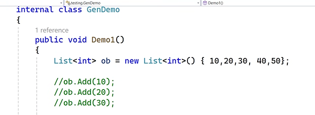
- Sort() -> used for printing letteres in Ascending order
- Reverse() ->used for printing letteres in descending order
- Example :

```c#
public void Demo1()
{
   List<int> ob = new List<int>() { 45,99,2,45,56,78,98};

   //ob.Add(10);
   //ob.Add(20);
   //ob.Add(30);


   // how to print individual value
   Console.WriteLine(ob[2]); // 30

   // how to print all the vlues

   foreach (var item in ob)
   {
       Console.WriteLine(item);
   }

   // how to print the length
   Console.WriteLine("total length is " + ob.Count);

   // how to sort the data
   Console.WriteLine("----------------");
   ob.Sort();
   foreach (var item in ob)
   {
       Console.WriteLine(item);
   }
   ob.Reverse();

   Console.WriteLine("----------------");
   foreach (var item in ob)
   {
       Console.WriteLine(item);
   }
ob.insert(20,200);
Console.WriteLine(item);
ob.Remove(200);
ob.RemoveAll(x=> x==200);
ob.RemoveAt(3);
ob.Removerange(2,5);
foreach (var item in ob)
   {
       Console.WriteLine(item);
   }
}
- insert() -> ob.insert(20,200);
```


- Capacity : it gives memory space , without mentioning the values
- Syntax :
- 
- console.WriteLine(li.capacity);
- To Remove excess storage:
- 
- Example : Add to cart logic
- 
- 
- 
- 
- Example :

```c#
    public void Demo4()
{
    // how to store product  details
    // pid pname price qty
    List<Products> li = new List<Products>();

    // Method-1
    Products p1 = new Products();
    p1.pid = 100;
    p1.pname = "shoes";
    p1.price = 3000;
    p1.qty = 2;


    Products p2 = new Products();
    p2.pid = 200;
    p2.pname = "Shirt";
    p2.price = 500;
    p2.qty = 5;


    li.Add(p1);
    li.Add(p2);

    // Method-2
    Products p3 = new Products() { pid = 300, pname = "monitor", price = 5000, qty = 8 };
    li.Add(p3);

    //Method-3

    li.Add(new Products() { pid = 400, pname = "cd", price = 120, qty = 2 });


    foreach (var item in li)
    {
        Console.WriteLine(item.pid + ":" + item.pname + ":" + item.price + ":" + item.qty);
    }

}

Products item=li[0]; //prints only 1st item
```

// to add many lists
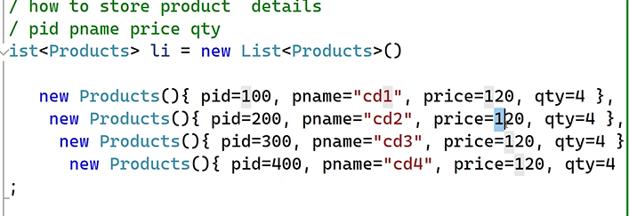

- Example: collection intializer method

```c#
List<Products> li = new List<Products>()
  {
      new Products(){ pid=100, pname="cd1", price=120, qty=4 },
       new Products(){ pid=200, pname="cd2", price=220, qty=4 },
        new Products(){ pid=300, pname="cd3", price=320, qty=4 },
         new Products(){ pid=400, pname="cd4", price=420, qty=4 },
  };


//  Products item = li[0];
// Console.WriteLine(item.pid + ":" + item.pname + ":" + item.price + ":" + item.qty);

  foreach (var item in li)
  {
      Console.WriteLine(item.pid + ":" + item.pname + ":" + item.price + ":" + item.qty);
  }
```

#### Dictionary : Key based


- Example :

```c#
public void demo5()
{

     Dictionary<int, string> d = new Dictionary<int, string>();

     d.Add(100, "india");
     d.Add(200, "canada");
     d.Add(300, "swiz");
     d.Add(400, "uk");
     d.Add(250, "us");
     d.Add(105, "japan");

     Console.WriteLine(d[200]);// prints canada
     SortedList<int, string> s = new SortedList<int, string>(d);
     foreach (var item in s)
     {
         Console.WriteLine(item.Key + ":" + item.Value);
     }

}
```

- Sorted List
- Key value pair

  #### Stack : LIFO

  - Items are arranged in LIFO

  ```cs
  public static void demo()
  {
    stack<string> s= new stack<string>();
    s.push("https://google.com");
     s.push("https://facebook.com");
      s.push("https://instagram.com");

      console.writeline(s.count);
       console.writeline(s.pop()); //print+ removes value
        console.writeline(s.peek); //prints
         console.writeline("----------");
    foreach( var item in s)
    {
      conole.writeline(item);
    }
  }
  ```

#### Queue

- Items are arranged in FIFO
- peek :prints top value
- Dqueue : removes last value

```c#
public void demo7()
{
     Queue<string> s = new Queue<string>();
     s.Enqueue("varun");
     s.Enqueue("pooja");
     s.Enqueue("Akhila");
     s.Enqueue("Akshita");
     s.Enqueue("Hemasri");

     Console.WriteLine(s.Count);
     Console.WriteLine(s.Peek());//prints top value
     Console.WriteLine(s.Dequeue());//removes last value
     Console.WriteLine("-------");
     foreach (var item in s)
     {
         Console.WriteLine(item);
     }
}
```

- To use many datatype , we can use like this
- 
- Implementation

- 

```c#
public void swap<T>(T a, T b)
  {

      T c = a;
      a = b;
      b = c;
      Console.WriteLine(a);
      Console.WriteLine(b);
  }
```

- All the methods wants to share the generic class
  
- We need to pass the data type in implementation also
  
- Custom class/methods

## Exception Handling :

### 1.Compile time Error

### 2.Logic errors :

- Output was wrong , but it will executes code

### 3.Runtime Error :

- Program is good , but input is wrong
- Runtime Errors occurs at : wrong data type , outofbound exception , file not found error, memory exception
  
- To solve runtime eros , we use
- 1. Try :
- 2. Catch:
- 
- 
- Can handle any type of errors , we have to keep it in at the end.
- 

```c#
try
{

    int a = int.Parse(Console.ReadLine());
    int b = int.Parse(Console.ReadLine());
    int c = a / b;
    Console.WriteLine(c);
}

catch(DivideByZeroException e) {
    Console.WriteLine(e.Message);
}
catch(Exception e)
{

    Console.WriteLine(e.Message);
}
```

- 3.Throw :
- 4.Finally :
- 
- Not sure about data tpe : we can use checked method
- 

```c#
try
{
     checked
     {
         byte b = 255;
         int c = ++b + 10;
         Console.WriteLine(c);
         // 266  276  error

     }
}
catch(Exception e)
{

     Console.WriteLine(e.Message);
}
```

- application exception provides exception class
- 

### Streams (file handling)

- How to create file :

```c#
public void Demo1()
{
    // how to create
    FileStream fs = new FileStream("E:\\proclink\\hello.txt", FileMode.OpenOrCreate, FileAccess.ReadWrite);


    // store data in a file

    StreamWriter sw = new StreamWriter(fs);
    sw.WriteLine("hello students");
    sw.WriteLine("lets learn file handling");

    sw.Close();
    fs.Dispose();
    Console.WriteLine("File create successfully");

}
```

- Implementation:
- 
- System.IO -> contains below
- File stream : Create file
- FileInfo : name , size, owner, date,time, path
- StreamReader: you read the content of the file
- StreamWriter: write content to the file
- BinaryWriter :write content to the file in binary format
- Binaryreader:read data from binary file
- Diretory: creates a folder
- Directory info : get info about folder

```c#
public void Demo1()
{
    // how to create
    FileStream fs = new FileStream("E:\\proclink\\hello.txt", FileMode.OpenOrCreate, FileAccess.ReadWrite);


    // store data in a file

    StreamWriter sw = new StreamWriter(fs);
    sw.WriteLine("hello students");
    sw.WriteLine("lets learn file handling");

    sw.Close();
    fs.Dispose();
    Console.WriteLine("File create successfully");

}

```

```c#
public void Demo2()
{
     // how to create

     FileStream fs = new FileStream("E:\\proclink\\hello.txt", FileMode.OpenOrCreate, FileAccess.ReadWrite);


     // read data from the file

     StreamReader sr = new StreamReader(fs);
   string str=   sr.ReadToEnd();
     Console.WriteLine(str);
     sr.Close();
     fs.Dispose();
     Console.WriteLine("File create successfully");
}
```

```c#
public void Demo3()
{

   // how to create folder
   Directory.CreateDirectory("D:\\proclink\\mydir");
   Console.WriteLine("created successfully");

}

 public void Demo4()
{

    // how to create folder
    DirectoryInfo d = new DirectoryInfo("E:\\proclink\\mydir");
    Console.WriteLine(d.FullName);
    Console.WriteLine(d.Parent);
    Console.WriteLine(d.CreationTime);
}
```

### Serialization :

- Process of converting an object to a stream/filesystem/network transferable
- Converting object to files
- 
  
- Deserialize
  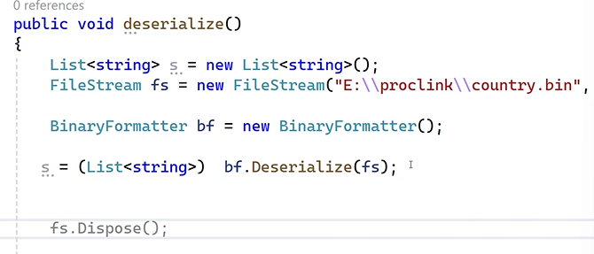
  

#### Types :

- Binary : data stored in binary format
- Soap [Simple Object Access Protocol]:
  xml format
- Xml: data stored in xml format
- json :data stored in json format

### Deserialization :

- Process of converting an file to objects
- Converting files to objects.

### Wednesday (10/7/2024)

### C# language Features :

#### Implicit Type Local variable : dotnet 3.0

- Example : var [variant] gives all datatypes
- 
- we are not sure about datatype , use "var" keyword.
- "var" keyword Automatically typecast to its corresponding datatype based on value passed.
- Rules :
- Only used for local varibale / local scope, not global variable
- can be used as method parameter
- multiple variable not supported
- 
- We have to assign the value , while declaring variable.
- We cannot assign null values to var

#### Nullable Type


- We acheived nulllable by using "?"
- normally Default value is " 0"
  
  

### Extension method


- want to add new methods to built in types like isUpper(), isLower() etc..
- Rule :
- 1.Method and class should be "Static"
- Method has to take 1 paramter.
- Example :

```c#
static class myext{
  public static bool IsEven(this int i){
     return i%2==0;
  }
}
```

### Inline Warning

- #pragma warning disable
- to restore :
- #pragma warning restore : again warning msg shows
  

```c#
 #region //exampleDemo
 #endregion
```


#### Partial Methods

- Partial Methods Used only inside partial classes
- Partial Methods made up of "Declaration + Implementation"
- "Declaration + Implementation" happens in 2 different files.
- if the body is in seperate file , we use Partial

```C#
public partial void methodnAME();{
 PUBLIC PARTIAL VOID dEMO(){

 }
}
```

- Not supose to give access specifier , default is private.

#### Anonymous Types

- Uses some features of particular method.
- 
  

#### Lambda Expressions [=>]

```c#
public void Demo()=> Console.WriteLine("");
```

#### Dynamic Support: 4.5 Version of .NET

- Dynamic keyword

```c#
public void demo()
{
  var a =10;
  dynamic d =10;
}
```

- similar to var
- we have to decide the data type at runtime
- we can assign any data type to dynamic , it changes according to the input
- Any type can be assigned , type changes
  

#### Office Programmability

- to convert dotnet data to msoffice like charts , data etc..
  

```c#
public static void hello()
     {
      //create instance of excel application
         dynamic excelApp = Activator.CreateInstance(Type.GetTypeFromProgID("Excel.Application"));
         excelApp.Visible = true; // Make Excel visible

         dynamic workbook = excelApp.Workbooks.Add();
         dynamic worksheet = workbook.Worksheets[1];

         // Write data to Excel
         worksheet.Cells[1, 1].Value = "Hello, Excel!";

         // Save and close Excel
         workbook.SaveAs("D:\\output.xlsx");
         workbook.Close();
         excelApp.Quit();
     }

```

#### Contravariance


```c#
public class Animal
    {
        public virtual void Speak()
        {
            Console.WriteLine("Animal sound");
        }
    }

    public class Dog : Animal
    {
        public override void Speak()
        {
            Console.WriteLine("Bark");
        }
    }

    public static void sound(Animal a)
    {
        a.Speak();
    }

    public static void Main()
    {
       sound(new Dog());
        sound(new Animal());
        Console.Read();
    }
```

#### Covariance


- covariance have more features as compared to 2.6
- and we can assign more properties to child class from parent class
- in 2.6 , we can able to add only 1 property , it was solved in present version
  

#### All the example of C# features

```c#
internal partial class CSharpFeatures
    {
        // implicit typed local variable


        public void Demo1()
        {
            // use var keyword if u are not sure about
            // datatype to be used
            // var keyword automatically typedcast to its
            // corresponding datatype based on value passed

            // rules
            // can be used only as local variable
            // cannot be used as method parameter
            // multiple variable not supported(var m, n, o;)
            // you have to assign the value while declaring
            //cannot assign null values


            List<int> list = new List<int>();

            var list1 = new List<int>();

            int a = 10; //integer

            var b = 20;
            var s = "hello world";
            DelegateDemo ob = new DelegateDemo();

            var obj = new DelegateDemo();

        }
        public int? MyProperty { get; set; }
        public void Demo2() {
            // reference type (class, string , interface, object, delegate)


            // value type ((int, float, double, boolen, byte)

            // nullable types
            //---------------

            // using nullable types we can assing null values for int, float datatypes
            // it is achived by using ? symbol


            int? i = null;
            float? f = null;
            // real time
            // database programming
            // id name marks(integer)
            // 10  raj  0

            if (i.HasValue)
            {
                Console.WriteLine(i.Value);
            }
            else
            {
                Console.WriteLine("i is null");
            }

        }

        public void Demo3()
        {// extention method

            string s = "hello world";


            // using extention method we can add new methods
            // to exisiting types

            // rules
            // 1. method and class should be static
            // 2. the method has to take 1 parameter

            int m = 11;
            Console.WriteLine(m.IsEven());


            string st = "10";
            int i = int.Parse(st);

            int j = st.ToInteger();


        }

        public void Demo4()
        {
            // inline warning

            // using inline warning feature we can disable the
            // warning messages
#pragma warning disable
            int s;
            int a;
#pragma warning restore
            int k;


        }

        public void Demo5()
        {/// object initializer
            Product p = new Product() { pid = 100, pname = "cd" };
            // collection initializer
            List<Product> li = new List<Product>()
            {
                new Product() { pid = 100, pname = "cd" },
            new Product() { pid = 200, pname = "books" }
           };

        }


        public void Demo6()
        {
            // what is partial methods
            // partial methods can be used only inside partial classes
            // partial methods = declaration + implementation
            // declaration and implementation happens 2 diff files


            try
            {
                int a = int.Parse(Console.ReadLine());
                int b = int.Parse(Console.ReadLine());
                Console.WriteLine(a/b);
            }
            catch(DivideByZeroException e)
            {
                // logging features(db + files)

                Console.WriteLine(e.Message);
            }


        }


        public void Demo7()
        {
            // anomymous type

            var res = new
            {
               name = "Sumanth",
                marks  = 90
            };

            Console.WriteLine(res.name);
            Console.WriteLine(res.marks);

        }
        // lambda expression
        public void Demo8() => Console.WriteLine(1000);


        public void demo9()
        {
            // dynamic keyword
            // .net 4.5

            var a = 10;// type is check at compile time
          //  a = "helloworld";

            // any type can be assinged / type changes accordinly

            dynamic d = 10;// run time
            Console.WriteLine(d);
            d = "hello world";
            Console.WriteLine(d);
            d = new mymath();
            d.cool();
        }
    }


    static class myext
    {
        public static bool IsEven(this int i)
        {
            return i % 2 == 0;
        }

        public static bool IsUpper(this string s)
        {

            return s.ToUpper() == s;
        }
        public static int ToInteger(this string s)
        {

            return    int.Parse(s);
        }

    }
```

## LINQ : 3.0 Version

- Language Integrated Query
- Follows Common programming model[common logic], Irrespective data source[xml,databse,lists etc...] application uses
- 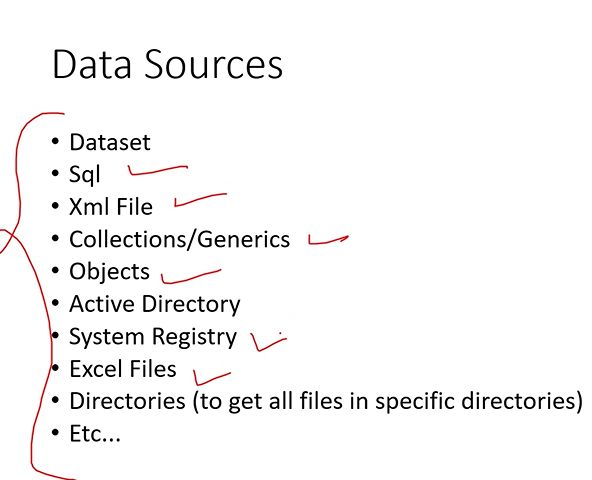
- 
- 
- 
- 
- 
- linq always starts with "from " keyword.
- 
- 
- 
- 
- Deffered Execution
- 
- Immediate Execution
- 

```c#
var res = (from t in li
             where t.price > 1000
             select t).ToList();

   li.Add(new Products() { pid = 600, pname = "Ram", price = 3000, qty = 1 });

   foreach (var item in res)
   {
       Console.WriteLine($"{item.pid} {item.pname} {item.qty} {item.price}");
   }
```

### Types of Linq

- Query expression:
- 
- Lambda expresion :
- Order by method:
- Take method [top rows]
- Skip method [offset]
- TakeWhile method[keep on printing until the condition is satisfied, like while looop]
- Skipwhile[keep on skipping , afteer it gets values and it will prints]

```c#
 var res = li.Where(t => t.price>500).OrderBy(t => t.price);
    var res = li.Take(3); //top three rows

    var res = li.Skip(2); //skips two rows

    var res =  TakeWhile(t => t.price != 5000); //keep on printing until that condition is not satisfied

    var res = SkipWhile(t => t.price != 5000 ); //skip the rows until 5000 is encountered


   var res = li.Select(t => new { productid = t.pid, productName = t.pname });
```

### Thursday (11/07/2024)

### SQL server

- RDBMS
- Using sql server we can manage data
- CRUD
- mAster database : Having user credentials, can also store the permision of user like who can access what.
- Model databse : sp_help it will shows the all the tables, sp_help employees it will gives the particular table details , sp_rename oldname , newtablename : able to change the table name , sp_helpdb : shows all the databases ,
- 
- mdf files : physical file of database table , procedures , tables
- ldf[log] files [30% of mdf file ]: contains deleted items
- model database contains : contains all the stored procedures created by user
- ms_db : jobs[used for scheduling the some task has to perform at some time, like taking backup of employees for a week ] , alerts[notifications] are stored in this db
- tempdb: used for testing data , it will stores that data in a temporary , also used for sorting data[used for rearranging the data]
- 
- 
- To run on command prompt :

```c#
 sqlcmd -E -S hemasriproclinkhyd\sqlexpress -d dbname
```

- 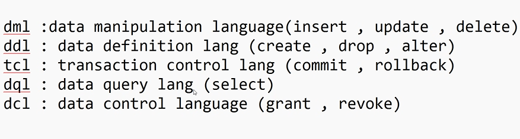
- Datatype types :
- 
- 
- 
- 
- 
- 
- orderid, custid ,productname, price ,orderdate, qty, description

### Friday (12/07/2024)

### Sub Query:

### Joins :

### Views :

- 
- 
- 
- 
- 
- sp_helptex viewname gives all the details regarding the created views.
- sp_depends maintablename : gives the connected tables
- sp_depends my view : gives all the data of main table

```c#
create a view viewname
with encryption
 as
```

- 3 Keywords :
- 1.  with encryption : It will restrict/hides to view the view
- 2.  with check encryption : Performs actions (select/update/delete) based upon the where condition
- 
- 3.  with schemabinding : cannot drop base table until view is dropped
- the table name must having dbo.table name , \* is not allowed in schema binding

### Monday(15/07/2023)

### Stored Procedures :

- Set of TSql statemets which is executed as single Unit
- Accept input paramenters and return output parameter values
- Types :
- 1. System defined procedures

- 
- loosely coupled : if we change one part of db, we can get the data as it is as before
- tightly coupled : if we change the data , it will effect on both tables . And result won't come
- 
- Network traffic : Don't have to send many lines of code. We can use procedures in 1 line like "sp_info"
- 
- 
- 
- 
- insert into table execute sp_procedurename
- 
- 
- 2 ways to handle errors in procedures:
- 1. try and catch
- 2. @@error : System defined variables
- 
- 
- 
- 2. User defined procedures : like sum , avg , max etc..

### Functions : part of query

- For mathematical operations we use functions.
- without return type , we cannot create a function
- 1 .Scalar function : returns 1 value
- 
- 
- 2. Table-Valued function; return rows and colums of a table
- 
- 
- inner join integrated with function
- We can also perform join on after creating function
- 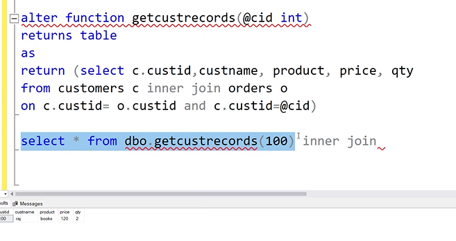

### Triggers

- 
- Triggers Cannot create without using tables
- Triggers called automaticlly
- Every trigger is apart of transaction
- 
- Any changes in the 1 table should reflects the another table
- Data integrity : Data was correct and valid
- We can able to give our own error messages
- 
- check Constraint : Proactive[checks validations 1st , and then implements]
- Triggers : Reactive[after inserting , it will checks and roll backs the data]
- 
- @@ROWCOUNT : variable used for counting the rows
- 
- 
- 
- 

```cs
alter trigger mytrig1 on customers
for delete
as
begin
select * from deleted
end


delete from customers where caddress ='hyd'

creaTe trigger mytrig2 on customers
for insert
as
begin
if exists(select * from inserted where age > 18)
begin
print ' you cannot insert age > 18'
rollback
end
end


insert into customers values(333,'pooja',50,'hyd')

 ------------------
create trigger mytrig3 on customers
for update
as
begin
select * from inserted
select * from deleted
end

update customers set age = 15 where custid =222

```

### Tuesday (16/07/2024)

### Indexes :

- Retrivel of data is very fast
- It improves performance
- Types:Clustered Index , Non-clustered
- 
- 
- 

## Intro to .Net Core :

## Entity Framework Core :

- 
- EF is a ORM Framework [Object Relation Mapping] : allows us to easily create and connect to db.
- Object : replica of table , class having its properties.it is in the c#
- 
- Relation : Back end structure [DB]
- Mapper : converter
- 
- 
- Earlier for .Net :--> Ado.Net : [Activex data object ]used for interacting with db ==JDBC
- Ado.net contains classes:
- 
- DisAdvantages of Adp.Net :
- Ado.net has many classes. So developers are unable to find what class to use
- Entity framework has 1 class
- 
- Type safe : compile time error
- Not type safe : Runtime error
- 
- when we want to change the db , and shifting to another db
- 
- 
- 

## Wednesday (17/07/2024)

### 2 APPROACHES TO WORK WITH DB:

- 1. DATA BASE FIRST : YESTERDAYS ALL TOPICS
- 
- 2. CODE FIRST :
- 
- We create classes and properties in c#
- We also create context class in c#
- We write linq queries
- the tables and db are create auotmaticallly in ssms
- When to use Code first approach
- 

## .Net core

- New framework from microsoft :A framework is like a structure that provides a base for the application development process.
- Used to build different types of applications
- It is written from scratch
- One of the key benefits of .NET Core is that it is modular, which means you can use only the components you need for your application, making it more lightweight and faster. Additionally,
- 
- 
- Platform independent
- source code of classes , objects are available in github to use
- 1 library is used to develop many
  applications
- 
- scalability : NET Core applications that usually need scalability are server applications that must process a lot of transactions very quickly, with very fast response times.
- 
- 
- 
- 
- 
- 
- 1. class library generates dll file
- console project generates exe files.

#### How to call library from console :

- 2. right click project =>add project reference=>select library =>ok
- 3. import the namespace =>create obj of the class

#### How to use a library present in nuget site :

- 1st method : tools=>newpackage =>manage nyget package for solution=>browaw=>newton=>install=>
- 2nd. dotnet add package newtonsoft.json

#### How to push packet to nuget.org site:

- create class lib project=>write necessary code=>open .csproj file(xml file)=>authtor, version=>create date/time, namespace=>right click on project=>click on pack=>generates nupkg file=> goto nuget.org file=>click upload file to website.

#### How to interact with db in .Net core

- we have to install packages {dotnet add package Microsoft.EntityFrameworkCore,
  dotnet add package Microsoft,EntityFrameworkCore.SqlServer,
  dotnet add package Microsoft.EntityFrameworkCore.Tools.}
- Decide databse first / code first approach
- need to run this command
  " dotnet ef dbcontext scaffold "Server=HEMASRI-GTEHYD\SQLSERVEREXPRESS;Database=proclink;Integrated catalog=true;TrustServerCertificate=true" Microsoft.EntityFrameworkCore.SqlServer --output-dir Models "
- 
- 

## Thursday (18/07/2024)

## ASP.NET CORE

- Webserver : used for hosting websites , it creates domain , used for processing server side language , Processes[complies] the server side languages like c#, java
- Client: Browsers
- Protocol: HTTPS use to carry a data between client and server.
- Physical path : It shows the website path
- Virtual Path : contains http//localhost/filename.html

#### IIS : To Host Website

- Right click on site => click on Default website =>click on add application=>give alias name , physical path [select folder ]=>click on ok
- Down we have content view=>click on it=> ot shows the files
- Search in chrome , we will get it

### 2 ways to develop web application in .net

### 1. .Net Framework 2000

#### asp.net :

- works only with windows
- good performance
- run on framework
- "Drag and drop"
- supports c#, visual basic
- having no container support

#### 2. .Net core 2016

#### asp.net core razor and asp.net core mvc[model view controller][part of .net core] :

- works with windows,mac, linux
- performance 4x
- run on framework and core
- there is no " Drag and drop"
- supports c#, visual basic, f#
- container support is best suited for deployement like Docker

#### Diff between razor and mvc pages :

- Both are cross platform
- Both supports multiple webservers
- Razor are suitable for very small and intermediate projects
- MVC designed for very large projects
- Razor pages lacks few features comparard to mvc , because it is designed for smaller projects
- In Razor pages each page contains its own code[having seperate .cs file]
- In MVC all the codes[.cs file is common] are centralized

## Intro to Razor

- 
- Contains c# and we can also add html,css,js codes to it.
- If we want to code in c# , we have to starts with "@"
- Having .cshtml extension
- 
- 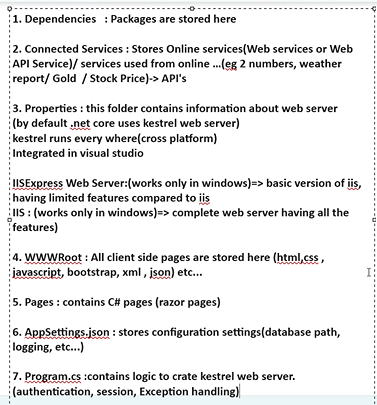
- 

## Friday (19/07/2024)

### Built in middleware

```c#
var builder = WebApplication.CreateBuilder(args);
```

- 1. Create kestrel webserver (load the kesterel webserver in memory)
- 2. This method will also load launch settings.json and appsettings.json
- 3. This method will return an object[which is a type of web application builder]
- 4. Using this return type ' we can configure :1.Dependency injection , 2.Middleware , 3.Add a services

```c#
// to convert to razor project
builder.Services.AddRazorPages();
//to convert to mvc project
builder.Services.AddMvc();
//load services to kaestrol websever
// using "app" we can decide define the rules[]
var app = builder.Build();
//to use services
app.UseStatusCodepages();// display the status code
app.UseStatusCodePagesWithRedirects("ErrorPage")// it redirects to error page , when user enters the wrong url
pp.UseStatusCodePagesWithReExecutes("ErrorPage")// url is samething , but it will also shows error message and also shows the page
app.UseHttpsRedirection();
app.UseStaticFiles();
app.UseRouting();
//first run authentication code
app.UseAuthorization();
//then run pages
app.MapRazorPages();
//what code should excuets in development environment : in launchsettings.json[we can chnage our project domain]
if (!app.Environment.IsDevelopment())
{
    app.UseExceptionHandler("/Error");
    // The default HSTS value is 30 days. You may want to change this for production scenarios, see https://aka.ms/aspnetcore-hsts.
    app.UseHsts();
}
// after this u cannot give any rules , it wont be exceute after app.Run()
app.Run();

```

- 

### Builder Methods : 1.Dependency injection

Coding Pattern in which a class receives the instances of objects it need(called dependencies ) from an external source rather than creating them itself.

- Classname obj=new classname();

#### Objects are creted in program class , so that all other pages can use objects , to reduce memory space

```c#
before var app=builder.Build();//these all are coming
builder.Services.AddTransient();//for each request , Seperate obj is created for every request
builder.Services.AddScoped();//single obj is create for each and every user
Ex: flipart adding to cart
builder.Services.AdddSingleton();// "1" created/used  for all users
Ex: booking tickets
builder.Services.Logging();// compulsory we have to use lambda expresions, we can store data in console, debug, AddEventLog().
```

- 
- To work with these all , we need to create a "interface"
- 

```c#
builder.Services.AddTransient<Interfacename, classname>();
IMyinter i ;

public indiaModel(Interfacename Interfacename Datatype)//to call the constructor
{
i=obj;
}
public string result;
public void Onget(){
  Guid guid=//genrerates unique id for evwery request from user
}
```

```c#
builder.Services.AddScoped<Interfacename, classname>();
IMyinter i ;

public indiaModel(Interfacename Interfacename Datatype)//to call the constructor
{
i=obj;
}
```

```c#
builder.Services.AddSingleton<Interfacename, classname>();
IMyinter i ;

public indiaModel(Interfacename Interfacename Datatype)//to call the constructor
{
i=obj;
}
```

- 1. interface, logic,
- 2. goto program.cs for singleton or transilent
- 3. razer page =>call obj , by using constructor

```c#
public interface IMyinter
{
    string AddNums(int num1, int num2);
    string DivideNums(int num1, int num2);

    string displayguid();
}
public class MyMathCls:IMyinter
{
    Guid g;
    public MyMathCls()
    {
        g= Guid.NewGuid();

    }
    public string displayguid()
    {
        return g.ToString();
    }
    public string AddNums(int num1 , int num2)
    {
            return "The sums is "+  (num1+num2);
    }

    public string DivideNums(int num1, int num2)
    {
        return "The Division is " + (num1 / num2);
    }
}
```

```c#
builder.Services.AddSingleton<IMyinter,MyMathCls>();
// seperate object is created for every request
//builder.Services.AddTransient();

// single object is created for each user
//builder.Services.AddScoped();

// 1 object is used  by all the user
//builder.Services.AddSingleton();
----

public class indiaModel : PageModel
{
    // this page will only use the object

    //  MyMathCls ob = new MyMathCls();
}
    IMyinter i;
    public indiaModel(IMyinter obj)
    {
        i = obj;

    }

    public string result;
    public void OnGet()
    {
        // result=  i.AddNums(10, 10);

        //  Guid g = Guid.NewGuid();
        result = i.displayguid();

    }
```

## Monday (22/07/24)

### INTRO TO MVC :

- 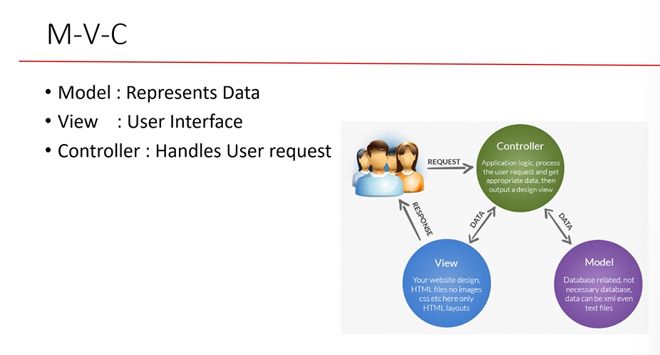
- 
- Architectural patterns
- 
- 
- view folder : .cshtml , .html files [Cannot be called directly the model ]
- 
- Model folder : Contains all DB related files , .cs , context files , model files , interacts with data
- Controller: contains all the logics of all files in "1" .cs file[centralized logic contains validations] except UI and db all logics contains here., Handles User Requests, Controller files has to end with .COntroller name in that file
- 
- App_Data folder: Temporary files
- App_start folder :Logic of Authentication , .cs file
- Content folder: stores all css, bootstrap files
- Scripts folder: .js , jquery files etc.
- Fonts folder: Contains All fonts files
- 

```c#
to add links to main page
    <a asp-controller="NAme" asp-action="Method Name">Proclink</a>
```

- 
- 
- 
- 
- 
- In TempDate , we can use it in any where in another method, controllers. by using "temp.keep("Parameter");".
- Helper class : To avoid duplicate codes
- @helper "MethodName"

### Action Selectors : Attributes

- 
- Above the Action Methods we use attributes
- 1.  Action Name:But we can apply to view methods
- 

```c#
[ActionName("ind")]
public string india()
{
    return " Welcome to India";
}
```

- For views we have to give view name in return type

```c#
[ActionName("viewdate")]
public ViewResult ShowDate()
{
    return View("ShowDate");
}
```

- 2. Non Action:
- 

```c#
[NonAction]// india method cannot be called from browser
public string india()
{
    return " Welcome to India";
}
```

- 3. ActionVerbs:
- 

## Tuesday (23/07/2024)

- Working on MVC project[Onlineshop]

## Wednesday (24/07/2024)

- Working on MVC Project[Onlineshop], feedback form

### Action Filters: All comes in form of Attributes{used in square brackets like httpget , httppost etc...}

- A set of logic which is applied before or after calling action methods.
- Types:
- 1. Output cache : Attributes , Allows us to store frequently access data in cache memory in order to increase application performance.
- Using output cache the pages gaurentees to run faster
- it acts like a ram , it stores the data in cache , and gives the faster results to users.
- Syntax:[OutputCache(Duration=10)]
- import "builder.Services.AddOutputCache();"
- 2. Exception Filter : We can display custom view page when run time error is encounterd.
- create a class with inherits ExceptionAttribute and override exception method.

```c#

    public class CustomExceptionFilterAttribute : ExceptionFilterAttribute

    {

        public override void OnException(ExceptionContext context)

        {

            context.Result = new ViewResult { ViewName = "Error" };

            context.ExceptionHandled = true;

        }

    }

- add it in program.cs file
builder.Services.AddControllersWithViews(
    c=> c.Filters.Add(new CustomExceptionFilterAttribute()));
```

- 3. Authentication :
- .Net supports many types of authentication
- 1. cookie based authentiction : we use collections claims and identities to handle this
- Working procedure :
  - 1.claims :peice of info about particular person or obj, always comes in key value based, example:age:21, address:hyd
  - 2.claim identity :collection of claims, ex: hemasri
  - 3.claim principle : collection of identities , ex: hemasri have adhar, id , pan all belongs to hemasri only
- We also use create cookie file(text file) in this type
- 2. JWT [json web token] authentication : this type of authentication very widely used in web api
- 3. Oauth authentication : in this type of authentication
     we use external website to get user information, instead of managing users manually.example : we give gmail to login into another sites like geeks for geeks

## Thursday(25/07/2024)

## Intro to Web API

## History

### Distributed Computing: Working with multiple systems

- 
- Components: UI[html,css,js, bootstrap],Business logic [Controller, class library, .cs] ,DB[Backend, sql server,MongoDB,excel etc...]
- 
- 

### Advantages of Distributed Computing:

- Team members can works simultaneously
- Faster Development
- single point of failure can be avoided
- Power of multiple systems[RAM,HardDisk]
- Load balancing : Requests are handled easily
- Distributed means it can be same network /different network
- 

### 1. Remoting(.Net) => RMI(java) : Introduced in 2000s , created by Microsoft

- Only supports windows
- All communications used happend in binary format
- 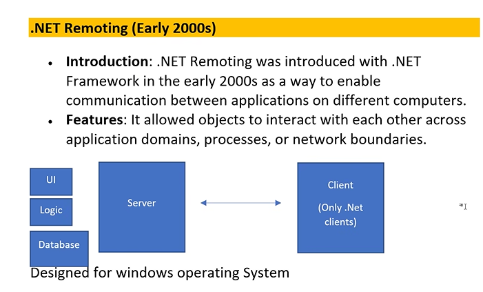
- Both clients and server are using same os , same language in Remoting
- Remoting will make it public, after that it will provide URL to use
- To avoid this problem , they introduced Webservices

### 2. Webservices :

- 
- Designed in XML format
- Only designed in .Net and Used by any client
- Converting from remoting to webservice is impossible

### 3. WCF[Windows communication foundation] : collection of many technologies

- 
- To make conversion was earlier in WCF
- 
- DrawBack : xml/Binary , Not suitable for Beginners , Many classes are required to devloper, it not light weight , Too many configurtions ,Not Open source

### 4. WEB API :

- Supports many formats [json, xml , Binary, Text format, custom format]
- Platform independent
- Open source
- Light Weight
- Simple to use it
- Easy for Beginners
- 
- 

## Web API : Pulling data from different sources and expose data to clients

- Follows REST(Represetational state transfer) principle
- 
- 
- 
- HTTP Methods :
- 
- GET (Server to Client)
- POST ( Client to server)
- PUT ( Update the data)
- DELETE( Cancel )
- 

### JWT Authentication work ?

- 
- with JWT Authenticattion ?

```c#
 http://localhost/simple/getlist-------->server

```

- 

- Steps:
- 1.  Server will not run the method
- 2.  Sever want to prove your authentciation
- 3.  user has to send username and password first
- 4.  the server will vallidate the credentials , if its correct . It will generate to token and send it to client
- 5.  Now the cilent has to use the token to call the method
- 6.  Token will have the expiry period

#### What is Token Madeup of : 3 Parts

- 
- 1. Header: Type of Authentication (jwt)
- 2. payloads : Expiry + claims
- 3. Signature : Combination of Header and Payload , signed with secret key
- 
- Output :
- 

## Friday (26/07/2024)

## Azure :

- Cloud[renting the pc] Computing platform
- We can Rent H/W, S/W, OS, Services , Virtual Machine

## Monday (29/07/2024)

## Consuming Web API

- We have to use XML HTTP Request [to interact with web api]class to use Web API
- It can communicate with anytype of webapi
- Synchronus :
- 
- Until Method1 complted method 2 has to wait
- If method1 having erros then method2 will not continue
- Asynchronus :
- If method1 having erros then method2 will continues its execution
- We can have to use "Task.Run()
- 
- Calling a Fake Web ApI
- 
- Status codes:
- 

## MicroServices

- Service means "Having multiple controllers "
- Microservice : dividing a large project into parts
- we can release part by part
- Example : Whatsapp , They are adding features one by one
- 
- Free to use any DataBase, any language

### Benefits of MicroServices :

- 
- Example :
- 
- Breaking into multiple Domains :
- 
- 
- Minimum one API , max many WEBAPI's

### Drwbacks of MicroServices :

- Difficult to integrate all the parts of MicroServices
- Many urls are created for different services by using MicroServices.

### Architecture of MicroServices

- 

### API Gateway :

- Dummy api for connecting the all the Web API's
- 

### Benefits of API Gateway :

- 
- 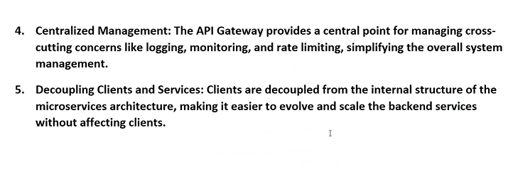

### Monolithic :

- Unable to dividing a large project into many parts.
- We have to wait , until all the steps are done in project.
- It's like giving all the versions of app at one time.
- 
- 
- 
- Single Deplyoment : One time publish the project to azure
- Single Runtime : Single language used to develop project
- Single Datbase : Ex -> sql , oracle
- Model is seperate , controller is seperate , view is seperate
- 
-

### Benefits of Monolithic :

- 

### Drwbacks of Monolithic :

- 
- All controllers are executed when one controller is called -> It takes longer time to load and run the project.
- Bigger Projects require more Developers , more system's CPU.
- Fault Tolerance : 1 thing is going wrong , all things will shutdown

- Need to create a json file to connect multiple webapi

```json
{
  "Routes": [
    {
      "DownstreamPathTemplate": "/api/Students/ShowStudents",
      "DownstreamScheme": "https",
      "DownstreamHostAndPorts": [
        {
          "Host": "localhost",
          "Port": 7014
        }
      ],
      "UpstreamPathTemplate": "/apigateway/Showstudents",
      "UpstreamHttpMethod": ["GET", "PUT", "POST"]
    },
    {
      "DownstreamPathTemplate": "/api/Teachers/Showteachers",
      "DownstreamScheme": "https",
      "DownstreamHostAndPorts": [
        {
          "Host": "localhost",
          "Port": 7112
        }
      ],
      "UpstreamPathTemplate": "/apigateway/Showteachers",
      "UpstreamHttpMethod": ["GET", "PUT", "POST"]
    }
  ]
}
```

- Now we need to give the "https" link for searching in browser

```c#
 "https": {
   "commandName": "Project",
   "dotnetRunMessages": true,
   "launchBrowser": true,
   "launchUrl": "swagger",
   "applicationUrl": "https://localhost:7015;http://localhost:5139",//need to use this https port number
   "environmentVariables": {
     "ASPNETCORE_ENVIRONMENT": "Development"
   }
 }
```

## RabbitMQ : Message Queue/Broker

- Created by Mozrilla
- Create by using "erlang" language
- To avoid Fault tolerance we are using RabbitMQ
- Message stored in Byte format in Queue.
- Communication is done by suing " AMQP" protocol
- 
- 

### Applications of RabbitMQ

- 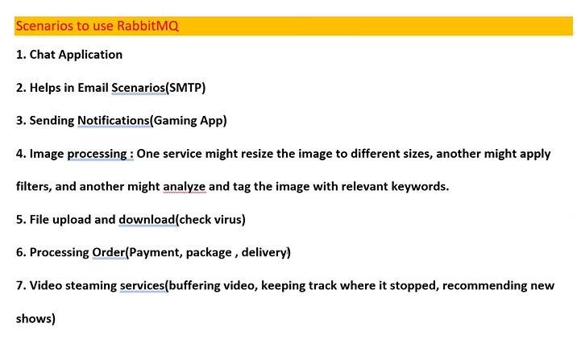

### Companies using RabbitMQ

- 

### Features of RabbitMQ

- 

### Architecure/Model of RabbitMQ

- 
- 

### Elements of AMQP System

- 

### 2 ways to work with rabbitMq

- Manual method
- Rebus - Automatic method :
- Install rabbitmq.clients
- Add class RabbitService.cs = job is to send msg and stored in queue
- import using RabbitMQ.Client;
- gives , Iconnection and Imodel interfaces
- // Step 3:
  //connect to Rabbitmq server
- 

## Tuesday(30/07/2024)

## Intro to Docker: Create Environment where in application can run anywhere irrespective of Platform

- 
- Platform , Allows developers to automate deployment
- 
- 
- 
- 
- 
- Unit Testing : done by Developers
- Integration , System Testing : QA Team
- User Acceptance : Devops
- 
- Docker comes in a picture where , the application should run on all the environments irrespective of platform
- 
- 3 options must be enabled : WSL ,Hiper v, Containers

## Intro to Containerization:

- 
- 
- 

## Docker contains of : 4

- 1. Container : Contains all required dependency (Runtime + packages + Configurations + settings + Application)
- Containers are always created from images
- 2. Images : Created from Docker file ,Always Read only
- 
- Daemon : means server
- what is Docker file ?
- Docker file[check list] contains all configuration and dependency settings which is required to run the application
- to work with dockers , we need to first create images
- 1 image can have may containers
- Container : Read and write working copy, it will have all the required dependencies
- Check list [docker file ] contains :
- 
- 3. Docker Repository : space present in online, where all the images are stored here
- 4. Docker Commands : all commands begin with " Doker start " , " docker stop , push , pull , run "
- 
- Docker Desktop : all images and containers are stored locally.

## Wednesday (31/07/2924)

- 
- 
- 

## Intro to Kubernetes : K8S [KeightS]

- Orchestration Platform
- 
- In orchestra, middle man was kubernet, his job is to manage all members(container)
- Kubernetes job is to manage container
- 
- 

## Advantages of Kubernetes :

- 1. Container Orchestration : manage and montoring the containers
- Command to monitor K8S :Kubernetcontroller[Kubectl]
- 2. Auto scaling : Increase and decrease containers
- 3. Self Healing : Create new cointainer if its crashes
- 4. load Balancing : Uses all Containers without keeping any container ideal
- 
- 

## Architecture of K8S :

- The picture happing in cluster[group of Containers / physical machine/vm]
- 
- cluster made up of : 1. Master node + Many Slave node
- 1. Master node : It manages[auto scaling, load balancong ,self healing] all Slave nodes
- 2. Slave node : contains pods
- 3. Pod : is equals to container
- Kubernetes creates pod , inside pod 1 or more containerers are there
- 1 pod can handle single project
- 4. Volume : contains backup of containers
- 

### To work with Kubernetes we need 2 files

- 1. Deployment.yaml file[yet another markup language]
- In this file , we need to tell how many pods are used , managed at one time
- 
- 
- 2. Service.yaml : It manages the network , systems levels
- for the purpose of load balaning
- 
- 
- 
- 
- 

- in deployment file

```cs
apiVersion: apps/v1
kind: Deployment
metadata:
  name: mywebapi-deployment
spec:
  replicas: 4
  selector:
    matchLabels:
      app: mywebapi
  template:
    metadata:
      labels:
        app: mywebapi
    spec:
      containers:
        - name: mywebapi
          image: hemasri1234/mywebapi:latest
          ports:
            - containerPort: 80

```

- in service .yaml

```c#
apiVersion: v1
kind: Service
metadata:
  name: mywebapi-service
spec:
  type: LoadBalancer
  selector:
    app: mywebapi
  ports:
    - protocol: TCP
      port: 80
      targetPort: 8080

```

- for running deployment.yaml

```c#
kubectl apply -f deployment.yaml

```

- for running service.yaml

```c#
kubectl apply -f service.yaml

```

- to get pods list

```c#
D:\DockerDemo\MyWebApi>kubectl get pods
NAME                                   READY   STATUS    RESTARTS   AGE
mywebapi-deployment-75b9c5d85b-nfwvn   1/1     Running   0          12m
mywebapi-deployment-75b9c5d85b-w2f97   1/1     Running   0          12m
```

- For adding

```c#
D:\DockerDemo\MyWebApi>kubectl scale deploy mywebapi-deployment --replicas=5
deployment.apps/mywebapi-deployment scaled

 InvalidImageName   0          8m30s
mywebapi-deployment-75b9c5d85b-hsclc   1/1     Running            0          8m30s
mywebapi-deployment-75b9c5d85b-nbrxh   1/1     Running            0          24s
mywebapi-deployment-75b9c5d85b-nfwvn   1/1     Running            0          22m
mywebapi-deployment-75b9c5d85b-w2f97   1/1     Running            0          22m
```

- for deleting specific pod

```c#
D:\DockerDemo\MyWebApi>kubectl delete pods mywebapi-deployment-75b9c5d85b-nbrxh
pi-deployment-75b9c5d85b-nbrxh
Running            0          24m
mywebapi-deployment-75b9c5d85b-w2f97   1/1     Running            0          24m
```

- Afteer that automatic replica was created

```c#
D:\DockerDemo\MyWebApi>kubectl get pods
NAME                                   READY   STATUS             RESTARTS   AGE
mywebapi-deployment-57cbbcfb55-4x557   0/1     InvalidImageName   0          5m25s
mywebapi-deployment-57cbbcfb55-mx9ln   0/1     InvalidImageName   0          13m
mywebapi-deployment-57cbbcfb55-qp5c4   0/1     InvalidImageName   0          13m
mywebapi-deployment-75b9c5d85b-dljr8   1/1     Running            0          2m30s
mywebapi-deployment-75b9c5d85b-hsclc   1/1     Running            0          13m
mywebapi-deployment-75b9c5d85b-nfwvn   1/1     Running            0          27m
mywebapi-deployment-75b9c5d85b-w2f97   1/1     Running            0          27m

```

- For running in vs code

```c#
D:\DockerDemo\MyWebApi>curl http://127.0.0.1:8080/Weatherforecast
[{"date":"2024-08-01","temperatureC":25,"summary":"Bracing","temperatureF":76},{"date":"2024-08-02","temperatureC":29,"summary":"Hot","temperatureF":84},{"date":"2024-08-03","temperatureC":45,"summary":"Scorching","temperatureF":112},{"date":"2024-08-04","temperatureC":18,"summary":"Freezing","temperatureF":64},{"date":"2024-08-05","temperatureC":29,"summary":"Mild","temperatureF":84}]
```

## Blazor :

- 

## Intro to Blazor

- 
- Frontend framework
- Created by Microsoft
- Blazor is developed by C# language
- Now in Blazor c# language can run inside the browser
  application
- Earlier c# was mean for backend....C# is also used for frontend
- Used for creating single webpage applications[SPA]
- SPA means Entire website
- 
- SPA is loaded in browser , one single page have all the header footers , content will be updated dynamically
- very user friendly for mobileapp
- Blazor = Browser + Razor
- 1 page many components , components contains dynamic data

## Features of Blazor

- 
- "Telerik" is used in Blazor for creating Rich UI Pages
- Telerik have built in filtering features

## Blazor Hosting Options

- 
- in csh - the browser wil runs its logic
- in SSh- the webserver runs it and converts to html and again send it to browser for results
- 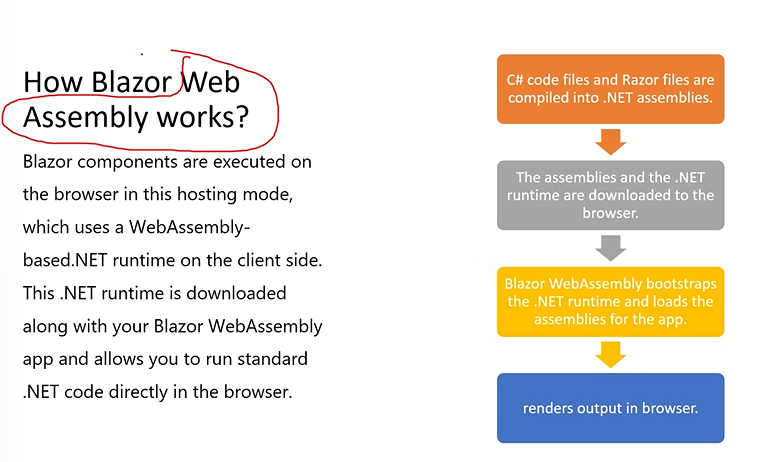
- The small clr[il to dll] was installed inside the browser to run c# codes
- Assembly- Dll, exe files
- 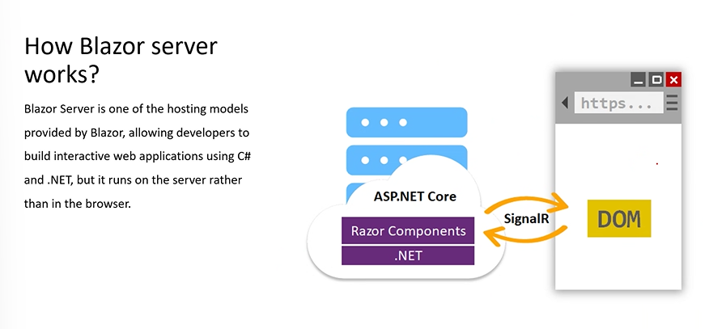

## Blazor Project Structure

- 

## Thursday(01/08/2024)

## Blazor Routing and Navigation

- 1.
- 
- We can shift C# code to another file called as code behind
- If we give different name to class and file, we can inherit the class
- 
- Routing : giving navigations to another page
- 
- 
- 
- Navigation to another page in html by using NavLink[the page is not reloaded,it will remains in same page]
- 
- 
- 
- 
- 

## Friday(02/07/2024):

- 
- Interface method : without creating many the objects , for every class
- It will gives loosely coupled , we use inject followed with interface name.
- 
- "Task" class Is running in different processor
- syntax : Public Task<datatype>methodname();
- Async methods run parllelly , so that i will uses task
- await : pls wait dont go for next line , if we dont write await i will go to another method

## Blazor Features

### javascript Interop[Sharing resources]

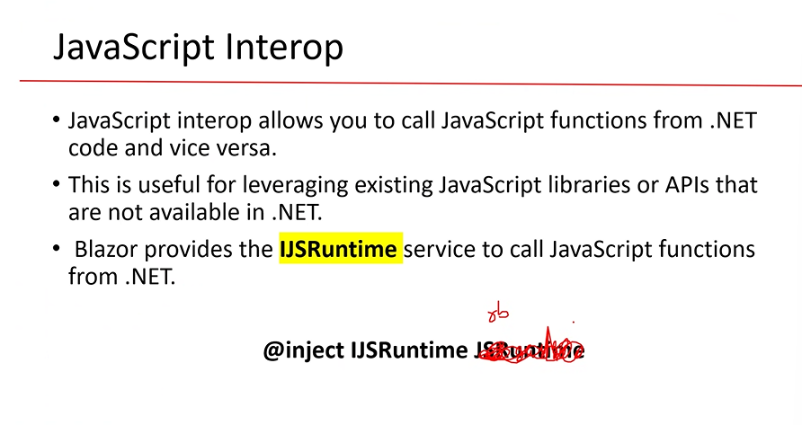

- We can use already designed methods in js , we can use it in blazor .Vice versa
- Its like reusability
- By using "IJSRuntime" inject method
- without paramter
- 
- with paramter
- 
- we can also pass many paramters
- 
- 

## Blazor Components

### Parent and child communciation

- the razor component can call another razor component
- 
- For Reusability
- 
- 
- 
- 

### SignalR

- 
- Client Server architecture
- Library
- Used in web Technology
- It will update the page automatically , without reload the page
- 
- 
- We have to download signalr
- import Microsft.AspNetCire.SignalR(1.1.0)

## Monday(05/08/2024)

### Telerik

- Unit Testing :
- 
- bUnit only meant for Blazor projects
- 
- Assert method is used to matvh the result and our expectation
- 
- 

## Security in Blazor

### Authentication

- 
- 
- 
- 1. Authentication State PRovider:
- Base class
- provides authentication state info
- This Class contains a method by name "NotifyAuthenticationStateChanged" which is used to notify application whether the user is authenticate or not.
- 
- way of informing Other pages that , the user is been authenticate , please alow this user
- 2. Authentication State :
- Authenticate and user should be admin or not
- check the Current state of User
- "IsAuthenticate " gives result as boolean values
- 3. Claim principle
- 4. AuthorizeView :Tag
- Display UI based on user's Authentication state
- its like adding the movies and viewing movies
- 
- 
- 
- 
- 

## Tuesday(06/08/2024)

- Logger
- Appsettings
- Authentication:jwt, cookies
- Memory configuration
- Cached Configuration
- 
